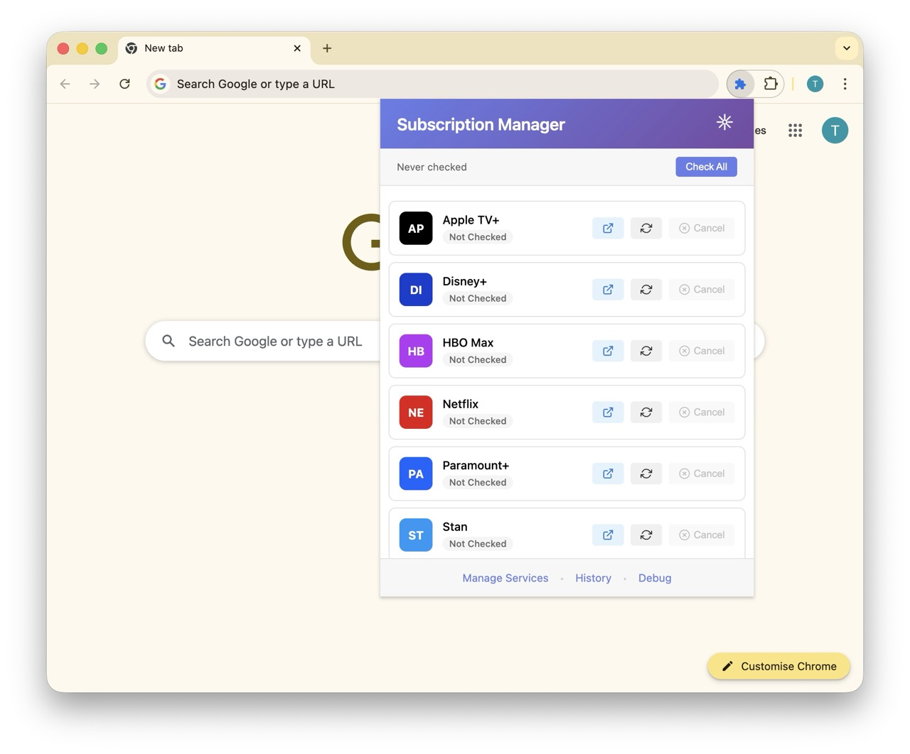
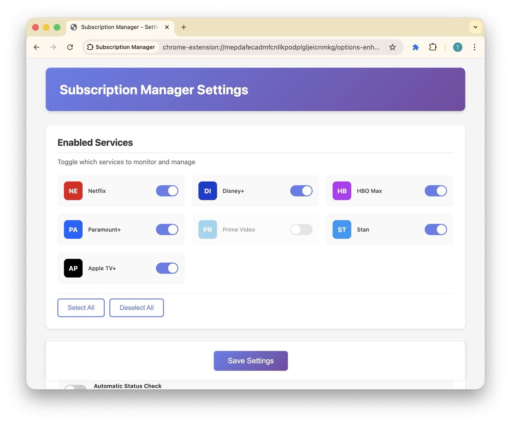

# Subscription Manager Browser Extension

> 🚀 **Early Access** - Automatically cancel your streaming subscriptions with one click

**The smart way to manage streaming services:** Cancel everything regularly, then resume only what you actually watch. You keep access until your billing period ends, and services make it trivial to resubscribe (but deliberately difficult to cancel). This extension flips that dynamic in your favor.

A browser extension that automates the entire subscription cancellation process. Simply click the cancel button, and the extension will automatically navigate through all confirmation screens and complete the cancellation for you.



## ✨ Features

- **Service Selection** - Toggle which streaming services you want to monitor
- **Status Check** - Instantly check if your subscriptions are still active
- **Automatic Cancellation** - Click cancel and the extension completes the entire process for you

*Runs entirely locally in your browser. Requires you to be logged into services beforehand.*

## 📺 Supported Services

Currently supports popular streaming and subscription services:

| Service     | Status       | Notes                                                            |
| ----------- | ------------ | ---------------------------------------------------------------- |
| Netflix     | ✅ Supported | Direct navigation to membership cancellation                    |
| Disney+     | ✅ Supported | Handles modal confirmations                                     |
| HBO Max     | ✅ Supported | Works with new Max branding                                     |
| Paramount+  | ✅ Supported | Navigate to account settings                                    |
| Prime Video | ✅ Supported | Amazon account integration                                      |
| Stan        | ✅ Supported | Australian streaming service - skips reason selection           |
| Apple TV+   | ⚠️ Limited   | Cross-origin iframe limitations - manual confirmation required |

## 🚀 Quick Start

### Installation

1. **Clone the repository**

   ```bash
   git clone https://github.com/yourusername/cancel-me.git
   cd cancel-me
   ```

2. **Load in Chrome/Edge**

   - Open `chrome://extensions/` (or `edge://extensions/`)
   - Enable "Developer mode" (toggle in top right)
   - Click "Load unpacked"
   - Select the extension directory

3. **Pin the extension**
   - Click the puzzle piece icon in toolbar
   - Pin Subscription Manager for easy access

### Basic Usage

1. **Login First** - Ensure you're logged into the streaming services you want to cancel
2. **Open Extension** - Click the extension icon in your toolbar
3. **Check Services** - Click "Check All" to see your active subscriptions
4. **Cancel** - Click the cancel button and the extension will automatically complete the entire cancellation process

## 🎯 How It Works

When you click the **Cancel** button for a service:

1. **Automatic Navigation** - The extension opens the service's cancellation page
2. **Smart Clicking** - Automatically clicks through all confirmation dialogs ("Are you sure?", "We'll miss you", etc.)
3. **Bypass Retention Offers** - Skips past discount offers and "please stay" screens
4. **Complete Cancellation** - Finalizes the cancellation without any further input needed
5. **Confirmation** - Shows you the cancellation confirmation page

**You stay in control:** The process only starts when YOU click the cancel button. No surprises, no automatic actions without your consent.

## ⚙️ Configuration

Access settings through the extension popup:



### Settings Options

- **Enabled Services** - Toggle which services to monitor
- **Auto Status Check** - Automatically check subscription status (coming soon)
- **Debug Mode** - Enable detailed logging for troubleshooting

## 🐛 Known Limitations

- Apple TV+ cancellation may have limited functionality due to iframe restrictions
- Some services require multiple confirmation steps
- Page layout changes may temporarily break detection
- Cannot bypass two-factor authentication or payment verification steps


## 📄 License

MIT License - See [LICENSE](LICENSE) for details

## ⚖️ Disclaimer

This tool is for personal subscription management only. Users are responsible for their own subscription decisions. The extension:

- ONLY cancels subscriptions when YOU click the cancel button
- Automates the cancellation process but requires YOUR explicit action to start
- Does NOT make unauthorized changes to accounts
- Does NOT store or transmit personal information
- Is NOT affiliated with any streaming service

---

**Early Access Notice:** This extension is in active development. Features may change, and bugs may occur. Please report issues to help improve the tool!

## 🆘 Support

- **Issues**: [GitHub Issues](https://github.com/yourusername/cancel-me/issues)
- **Feature Requests**: Open an issue with the `enhancement` label
- **Security**: Please report security issues privately

---

Made with ❤️ for subscription sanity
